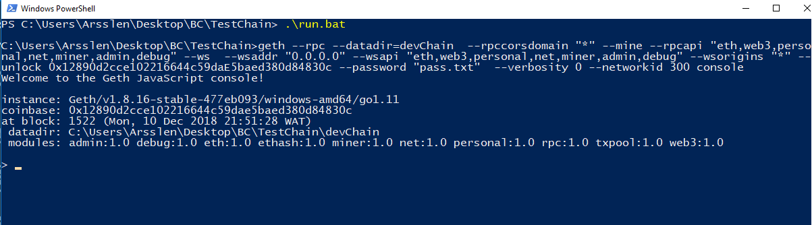
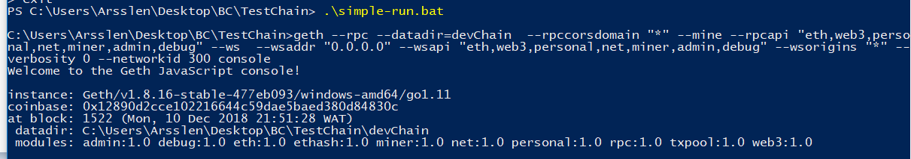

Ethereum: Setting Up A Private Blockchain
====

# Environment Setup
- Create a working data folder/directory for the private ledger. It will be used to hold binaries and configuration files in our case it will be called **devChain**.
- Go the [Go Ethereum (geth)](https://geth.ethereum.org/downloads/)
 site and download the binary for your operating system. (the version might have changed by the time you are going through this).
- Unzip and copy the geth binary to your working folder/ in case you have windows just install it and make sure the installation path is in the PATH environment variable.


The geth binary is the ethereum runtime, to run it you need to give some information via a configuration file. I’ll go into the details of the configuration file in the next step.

To run a private network you need to provide geth with some basic information required to create the initial block **the genesis block**.

```json
{
    "config":{
        "chainID": 444444444500,
        "homesteadBlock": 0,
        "eip150Block": 0,
        "eip150Hash": "0x0000000000000000000000000000000000000000000000000000000000000000",
        "eip155Block": 0,
        "eip158Block": 0,
        "byzantiumBlock": 0,
        "daoForkSupport": true,
        "clique": {
          "period": 1,
          "epoch": 30000
        }
     },
     "alloc" : {
          "12890d2cce102216644c59dae5baed380d84830c": {
            "balance": "0x90000000000000000000000000"
          }
     },
     "coinbase" : "0x0000000000000000000000000000000000000000",
     "difficulty" : "0x1",
     "extraData" : "",
     "gasLimit" : "0xffffffff",
     "nonce" : "0x0000000000000042",
     "mixhash" : "0x0000000000000000000000000000000000000000000000000000000000000000",
     "parentHash" : "0x0000000000000000000000000000000000000000000000000000000000000000",
     "timestamp" : "0x00"
}
```

Let’s explore the configuration file

**config**: This is the main blockchain configuration and it has the following properties

**chainId**: The chain identifier, it has to be an integer. It is also used to protect against replay attack. I will not be going into replay attach in this tutorial **it needs to be different than 0**.

**alloc**: This is used to allocate ETH to addresses i.e. to pre-fund accounts.

**coinbase**: also known as etherbase is the default primary account. You will get a warning if this value is not set but that can be safely ignored for now, you can set it later.

**difficulty**: This determines how difficult it is to mine a block. For a private blockchain it is better to set it to a low number to ensure blocks are mined quickly which utlimately translates to faster transactions.

**extraData**: Block extra data, it defaults to the client version if not provided.

**gasLimit**: This dictates the maximum amount of gas that can be used in each block. The higher the value the more transactions can be squeezed into a block.

**mixHash**: Not relevant to a new private network, set to 0

**parentHash**: Not relevant to a new private network, set to 0

# Running the private ledger
In the ledger provided in the repository i have created two accounts with password (password).

so in order to simply launch it and login in as **0x12890d2cce102216644c59daE5baed380d84830c** just execute ``run.bat``.


otherwise just run ``simple-run.bat``:


# Commands
Take your time to check this link
https://ethereum.stackexchange.com/questions/28703/full-list-of-geth-terminal-commands

# Mining
to start mining just type ``miner.start(1)`` if you ran the ``run.bat``

to stop it just type ``miner.stop()``


# Ethereum-Wallet
Install ethereum wallet from https://www.ethereum.org/ 

# Join the 1st peer
In the geth console of your 1st peer, type:

```
admin.nodeInfo.enode
```
Output will look like this:

```
enode://dcff6d9dcb14eeb1d1b7575b0653fa1025ad1b7722c6d652d0449f0966e97931bdf037e5542086e7b9e0bec056566522c6c0cc4d73d8e4186a35da8aa5988e15@[::]:30303
```
In the geth console of your new 2nd peer, type:

```
admin.addPeer( “enode://b56882b93f4f97dd69f98c1dca1bd751c72374b5a8b5852288a56059a8cbc63614afd57274cfa7695178cf292aad9e682f0117044f9a28c9e098da688c8dfd89@127.0.0.1:30303” )
```

Make sure you replace ``enode://…@`` above with the output from admin.nodeInfo.enode which is specific to you. As shown above, the ``[::]`` is replaced with ``127.0.0.1:30303`` which is the ``IP:Port`` of the 1st peer.

# Verify your nodes are now communicating
In the geth console of your new 2nd peer, type:

```
admin.peers
```

Output should show that peer 2 is connected to ``127.0.0.1:30303``


# Sources

https://medium.com/mercuryprotocol/how-to-create-your-own-private-ethereum-blockchain-dad6af82fc9f

https://medium.com/coinmonks/ethereum-setting-up-a-private-blockchain-67bbb96cf4f1

https://nethereum.readthedocs.io/en/latest/